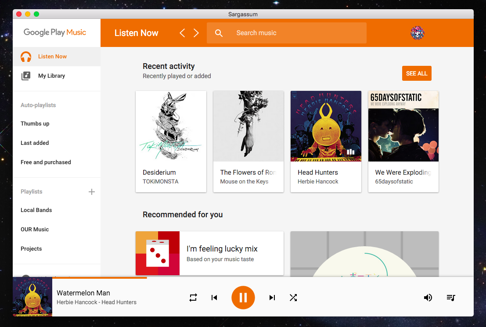

#  Sargassum

> A desktop client for Google Play Music

Automatically binds the global media keys for a more native experience.

## Development

###### Commands
- Init: `npm install`
- Run: `npm start`
- Build: `npm run build-osx`

## Liscence
MIT © [Daniel Pham](https://danhp.github.io)
